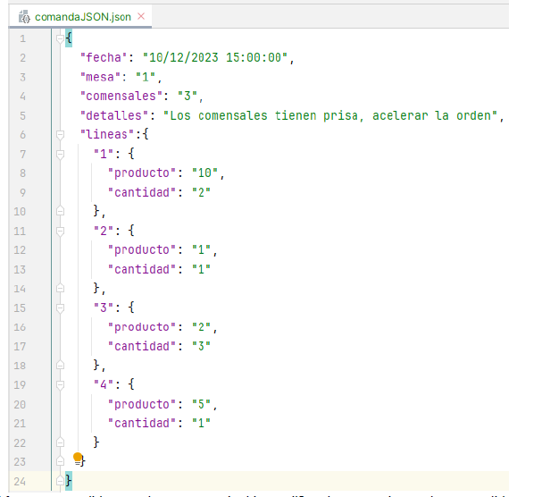
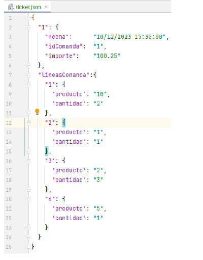

# DWES → AEV2 - MVC DOCTRINE y API Básica.

## Descripción:

Esta actividad evaluable consiste en crear una API que sirva para que una aplicación de cliente pueda conectarse al servidor del BAR JUAN.
El objetivo es que en el Bar JUAN puedan usar la aplicación tanto para las comandas como para la generación de tickets y gestión de pedidos a los proveedores.

## Recursos generales:

Presentaciones y videos de los temas 1, 2, 3, 4, 5, 6 y 7:
Material de apoyo:
Todo lo visto en el curso hasta ahora.
Usar script creación BB.DD. barjuan.sql en formato SQL que se ha entregado junto con los recursos de la actividad.

## Actividades:
Para ello se pide:

1.Usando la estructura que hemos ido viendo en la asignatura crearemos una aplicación web, que use un patrón MVC, TWIG y Doctrine. No es necesario usar PHP-DI.
    1.1.Se tendrá en cuenta si se usa un contenedor de Docker para el desarrollo. El contenedor debe tener instalado como mínimo:
    
    1.1.1.PHP 8 o superior.
    
    1.1.2.Una BB.DD. mysql.
    
    1.1.3.Instalado el gestor de dependencias Composer.
    
    1.1.4.Y cualquier otra aplicación o sistema que se considere necesario.
    
    1.2.Entregar el fichero DockerFile con la configuración del contenedor.

2.A partir de la plantilla usada en el AEV1, debes crear una pantalla inicial que sirva para que en el BAR Juan puedan acceder a ver el stock y realizar pedidos a los proveedores.
    
    2.1.En la sección de stock, tendremos a fecha del día cual es el último stock de todos los productos que tengas existencias. Para ellos, deberemos listar de la tabla stock cada uno de los productos con la última fecha y la cantidad de su stock.
    
    2.2.También podremos introducir una fecha y nos mostrará el stock de cada producto para esa fecha.
    
    2.3.Si entramos en la sección de pedidos, debe entrar en un formulario que nos permita crear un pedido nuevo a un proveedor. Una vez creado un pedido, nos mostrará una tabla en la que añadiremos todas las líneas que tenga ese pedido. Al guardar todas las líneas, daremos por finalizado el pedido y generará por pantalla de una estructura JSON con todos los datos del pedido y las líneas del pedido.
    
    2.4.Además de esto, tendremos la opción en la pantalla anterior, en vez de generar un pedido, poder listar todos los pedidos existentes. En cada pedido debe mostrar las líneas asociadas a cada uno de los pedidos. Este listado se generará por pantalla en una estructura JSON.

3.En el Bar Juan tienen unos terminales, con una aplicación de cliente que se encarga de las gestiones de las comandas y organización de la sala, con la distribución de las mesas y los tickets.
    
    3.1.La gestión de comandas a cocina será a partir de la creación de las comandas por parte de los camareros, que se grabarán en la tabla comandas y lineascomandas. Será el cliente quien cree un formulario para la inserción de la comanda y por lo tanto, nosotros recibiremos mediante una petición POST con los siguientes datos remitidos en una estructura JSON asociada.
    

    3.2.De igual forma, es posible que alguna mesa decida modificar la comanda, por lo que recibiremos por PUT a la misma ruta que teníamos en el punto anterior, de nuevo la estructura JSON asociada y con el mismo formato, de forma que tendremos que actualizar la comanda actual.

    3.3.En ambas opciones deberemos devolver la id de la comanda y en la respuesta el código de estado correspondiente: 201 si se ha creado o actualizado correctamente ,400 si algún dato no se puede procesar adecuadamente y 500 si no se ha podido procesar la petición por algún error del servidor.

4.Cada vez que desde cocina saquen una línea de la comanda, su terminal de cliente se encarga de enviar una actualización al servidor, con la línea de la comanda y la petición PATCH a una ruta exclusiva para este tipo de actualización, por ejemplo: /entregadaLineaComanda,
    
    4.1.Al mismo tiempo que actualizamos la línea de la comanda, deberemos hacer una nueva entrada en la tabla de stock, en la que deberemos buscar cual es el último stock de ese producto y restarle la cantidad de la línea de la comanda.

    4.2.Si al entregar la línea de la comanda, estuvieran todas las líneas de la comanda como entregadas, actualizaremos el estado de la comanda también.

    4.3.Deberemos devolver una respuesta con el código de estado correspondiente: 201 si se ha creado o actualizado correctamente ,400 si algún dato no se puede procesar adecuadamente y 500 si no se ha podido procesar la petición por algún error del servidor.
    
5.Cada camarero tiene en su terminar de cliente la opción de generar ticket. Para ello, deberá siempre de estar la comanda en estado de cerrada.

    5.1.Para poder generar el ticket, lo primero que tendremos que hacer es comprobar el estado de la comanda, de forma que, si la comanda aún esta activa, no se podrá generar.
    
    5.2.Una vez confirmado que se puede hacer el ticket, mediante la id de la comanda deberemos generar un ticket. En nuestro servidor generar un ticket equivale únicamente a insertar en la tabla tickets un nuevo registro con los datos de la comanda. Es importante, deberemos calcular el importe total del ticket, que será igual al precio por la cantidad de cada producto de las líneas de la comanda.

    5.3.Una vez generado el ticket, devolveremos al cliente una estructura JSON que tendrá que contener todos los datos necesarios para que el cliente pueda sacar impreso el ticket. Se entrega un ejemplo de formato de esa estructura y en la respuesta el código de estado correspondiente: 201 si se ha creado o actualizado correctamente,400 si algún dato no se puede procesar adecuadamente y 500 si no se ha podido procesar la petición por algún error del servidor.
    

## License

This work is licensed under a Creative Commons Attribution-NonCommercial-NoDerivatives 4.0 International License.

## Credits

Authors: Héctor González Mora 

Github: https://github.com/fdiaz-alonso/AEV2-HectorGonzalezMora
